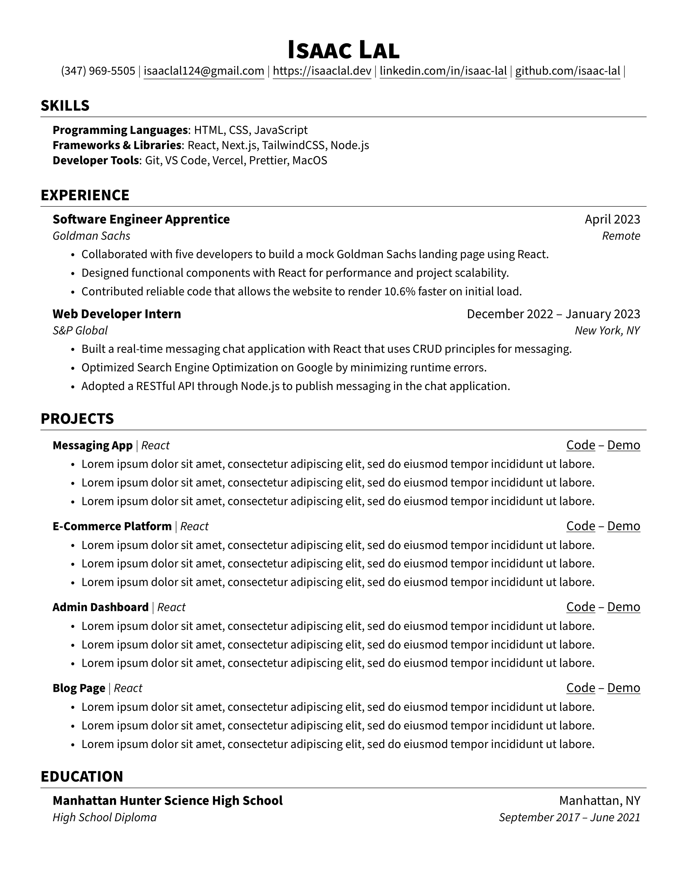
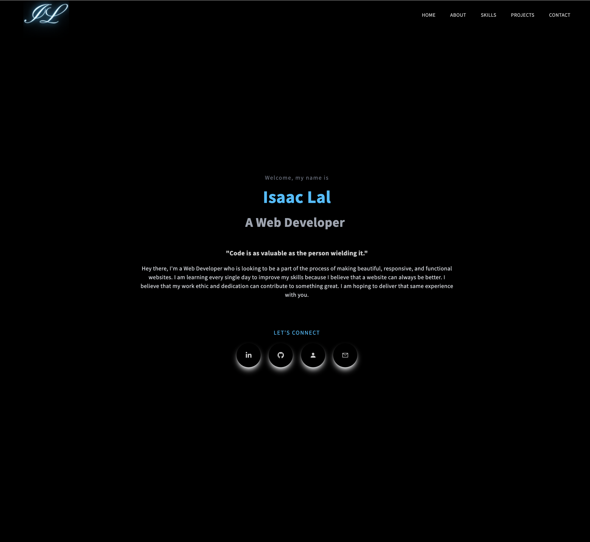

<h1> Hello, World! I'm Isaac Lal  </h1>

**`Software Engineer`**

<h4>I'm a Software Engineer that specializes in full-stack web development by implementing both front-end design and configuring the back-end. Looking to be a part of the process of making beautiful, responsive, and functional products, I am learning every single day to improve my skills. With the belief that my work ethic and dedication can contribute to something great, I hope to have the opportunity to deliver that same experience with you.</h4>

 
 
   

<h3 align="center">
    
[💼 MY PORTFOLIO 💼](https://isaaclal.com/)
    
</h3>
   
---

    
<h3 align="center">
    
<!--
<h3 align="left">🖥️ Technologies</h3>

 
 

 

 

-->

<h3> 🖥️ Technologies </h3>
    

<h4> Front-End </h4>

<h4>Back-End</h4>

<h4>Tools<h4>

    
 
 

<h3>👔 Resume</h3>

 
 
<h3>📝 Projects </h3>
<!-- PROJECTS -->

<table>
<tr>
<td width="50%">
<h3 align="center">Portfolio Website</h3>
  
  
    
 
 	  

    
  

 

Enjoy!

</td>		
	
<td width="50%">
<h3 align="center">Upcoming Project</h3>
  
  
    

 
 	  

    
  

 

Enjoy!

</tr>
<tr>
</td>
<td width="50%">
<h3 align="center">Upcoming Project</h3>
  
  
    

 
 	  

    
  

 

Enjoy!

</td>		
<td width="50%">
<h3 align="center">Upcoming Project</h3>
  
  
    

 
 	  

    
  

 

Enjoy!

</tr>

</table>

 
     
    
<!-- STATS -->
<h3 align="left">📊 Statistics</h3>

  

 

&nbsp;

 

 
	

<!---
<h3>😂 Humor </h3>

<h4> When I find a bug in my code </h4>

<h4> How I feel after a one hour tutorial </h4>

<h4> What happens to devs when Stack Overflow goes offline </h4>

<h4> Learning all Web Development Technologies be like... </h4>

<h4> The feeling when you complete a project </h4>

<h4> This is the truth lowkey </h4>

-->
 

    
 <h3>👨‍💻 Isaac's Coding Journey</h3> 

