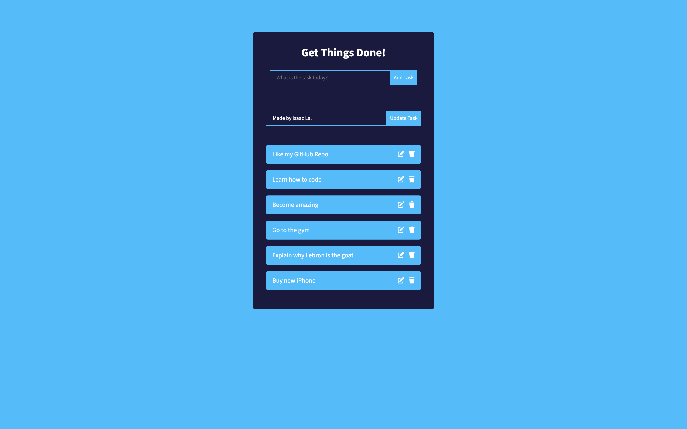
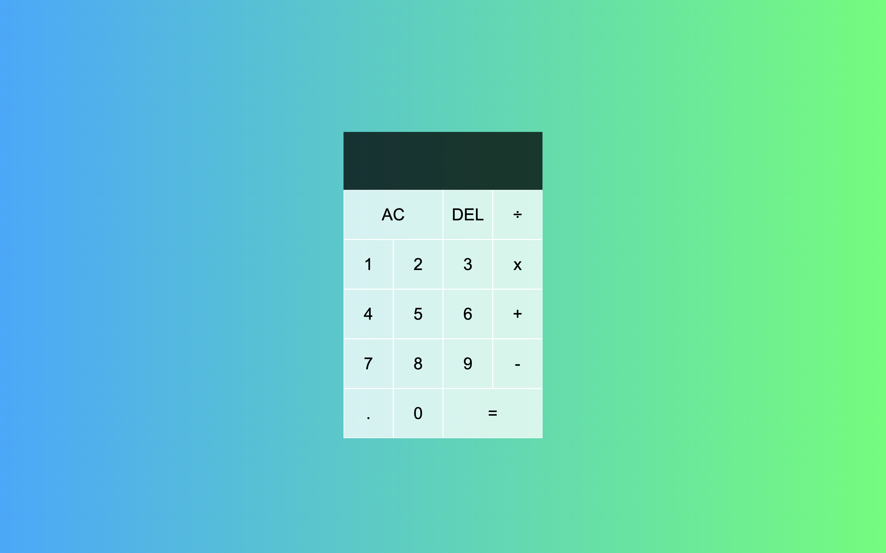

<h1> Hello, World! I'm

[Isaac Lal](https://isaaclal.com/) </h1>

**`Web Developer`**

<h4>I'm a Web Developer with a strong passion for creating web applications. I constantly improve my skills through practical experience and a love for learning. My main goal is to design attractive interfaces and dependable features for user-friendly experiences. I'm driven by a relentless desire for growth, always eager to explore new technologies and push my limits in this ever-evolving field.</h4>

---

    
<h3 align="center">

<h3> 🖥️ Skills </h3>
    

<h4> Programming Languages </h4>

<h4>Frameworks, Databases, and Libraries</h4>

<h4>Developer Tools<h4>

<h4>Services</h4>

 
 

<h3>👔 Resume</h3>

coming soon.

 
 
<h3>📝 Projects </h3>
<!-- PROJECTS -->

<table>
<tr>

<td width="50%">
<h3 align="center">Todo List</h3>
  
  
      

 
 	  

    
  

</td>		
	
<td width="50%">
<h3 align="center">Weather App</h3>
  
  
      

 
 	  

    
  

</tr>
<tr>
</td>
<td width="50%">
<h3 align="center">Entertainment Search</h3>
  
  
      

 
 	  

    
  

</td>		
<td width="50%">
<h3 align="center">Calculator</h3>
  
  
      

 
 	  

    
  

</tr>

</table>

 
     
    
<!-- STATS -->
<h3 align="left">📊 Statistics</h3>

  

 

 

 

 

 

    
 <h3>👨‍💻 Isaac's Coding Journey</h3>  

I'm a Web Developer, specializing in full-stack, who loves creating functional applications that are pleasing to look at and easy to use. I've been using websites since I was young, relying on them for entertainment and information every day. The web has changed my personal life a lot and got me curious about the steps to build websites. Things like design, efficiency, and features, and how they work together, made me really want to learn how to make them myself. This led me to want to join the process of making web applications so that other people can feel the same happiness I have felt.

My journey began by following tutorials on YouTube to create simple websites using basic HTML and CSS. Later, I added JavaScript for functionality and custom animations. I made numerous small projects and a couple of larger websites before advancing. After mastering the basics, I dove into frameworks, libraries, databases, and services. This allowed me to explore Full-Stack Web Development deeply. These skills enabled me to set up both the front-end and back-end of applications, ensuring a seamless and steady development process.

Eager to expand my knowledge, I've consistently been learning every day from various resources to improve my skills. Going from knowing nothing about the web to having a solid concept of what it involves makes me want to learn even more. Adopting a growth mindset toward development has enabled me to understand key concepts and turn them into complete applications. With these acquired skills, I'm able to create functional software that work well and look impressive. I'm very excited to keep learning more each day, to increase my knowledge and provide the best experience to my users.
