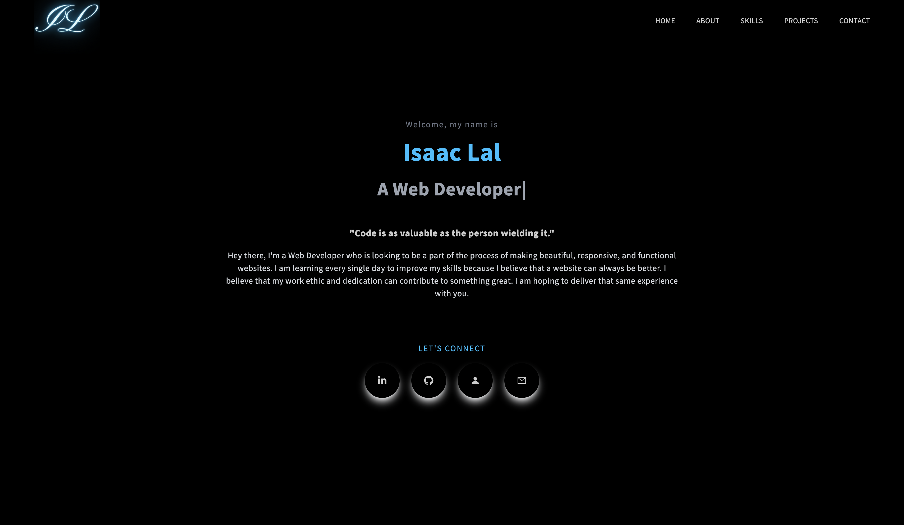
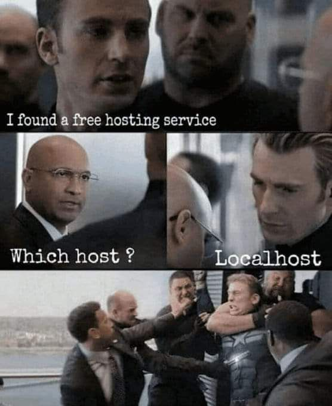

<h1> Hey, I'm Isaac Lal  </h1>

**`Web Developer`**

<h4>Hey there, I'm a Web Developer who is looking to be a part of the process of making beautiful, responsive, and functional websites. I am learning every single day to improve my skills because I believe that a website can always be better. I believe that my work ethic and dedication can contribute to something great. I am hoping to deliver that same experience with you.</h4>

---

    
<h3 align="center">
    
<!--
<h3 align="left">🖥️ Technologies</h3>

 
 

 

 

-->

<h3> 🖥️ Technologies </h3>
    

<h4> Front-End </h4>

<h4>Back-End</h4>

<h4>Tools<h4>
    

<h3 align="center">
    
[💼 My Portfolio 💼](https://isaaclal.com/)

[📄 My Resume 📄](https://drive.google.com/file/d/1hcCdqKBZ10_lcXw2sxjS_SyyPTbTAB4r/view?usp=drivesdk)
    
</h3>
    
 
    

 

<h3>👔 Projects</h3>

    
<!-- PROJECTS -->

<table>
<tr>
<td width="50%">
<h3 align="center">Portfolio Website</h3>
  
  
    

 
 	  

    
  

<strong>HTML, CSS, Javascript</strong>

Description goes here

</td>		
	
<td width="50%">
<h3 align="center">Portfolio Website</h3>
  
  
    

 
 	  

    
  

<strong>HTML, CSS, Javascript</strong>

Description goes here

</tr>
<tr>
</td>
<td width="50%">
<h3 align="center">Portfolio Website</h3>
  
  
    

 
 	  

    
  

<strong>HTML, CSS, Javascript</strong>

Description goes here

</td>		
<td width="50%">
<h3 align="center">Portfolio Website</h3>
  
  
    

 
 	  

    
  

<strong>HTML, CSS, Javascript</strong>

Description goes here

</tr>
		
</table>

    
 
     
    
<!-- STATS -->
<h3 align="left">📊 Statistics</h3>

 </a> 

 

&nbsp;

 

 

<h3>😂 Humor </h3>

<h4> When I find a bug in my code </h4>

<h4> How I feel after a one hour tutorial </h4>

<h4> What happens to devs when Stack Overflow goes offline </h4>

<h4> Learning all Web Development Technologies be like... </h4>

<h4> The feeling when you complete a project </h4>

<h4> This is the truth lowkey </h4>

 

    
 <h3>👨‍💻 Isaac's Coding Journey</h3> 

    

I was always fascinated with the web ever since I was a kid in middle school. I had no idea what technology was until December 2015, when I was in 7th grade, because I was never exposed to it in my childhood. My English teacher gave me a laptop for the first time to type my essay on, and I instantly fell in love with it. I would just go on Google to search up a lot of things that interested me, and it always had the answers to everything. Knowing the power of Google just made me fall in love with technology, and it just continues to rapidly improve as time passes.

Fast forward to 2022, when I am in college pursuing a Computer Science major. I had absolutely no idea what I wanted to do for my career. There were so many options like Web Development, App Development, Machine Learning, and Game Development just to name a few. I tried making atleast one of every single project for the different tech fields and learning the concepts, but I fell in love with Web Development 100x more than every other field. It was so fun designing my websites and I was extremely engaged working on them that I continued to improve my skills.

With the goal of creating my own professional website, I had decided to learn about HTML and CSS to start. These two technologies helped me to create a very basic website with limited functionality, but still looked decent. After that, I have devoted most of my time in mastering JavaScript and concepts like if-statements, for-loops, logic, and transitioning into learning about Data Structures & Algorithms, along with the Document Object Model (DOM). After JavaScript was done, I am now using my time to learn everything about React and styling with Tailwind CSS.

In my experience being a front-end developer, I have loved all the technologies that I am using and how it's evolving my creativity and making me more efficient overall and unlocking my designing potential. I am now mastering my craft in front-end development by learning Next.js and other tools that will speed up the production of design. I definitely am loving the process of Web Development and it really helps me to appreciate the product that I create in the end.

Now, I am pursuing Full-Stack Web Development as a way to master my skills and create my dream website projects sooner. I am learning every single day to hone my skills and learn new technologies that just make developing websites easier and more fun to do. As I master my skills, my work is improving very steadily. I am very engaged in the process and I will continue to be engaged and deliver quality, immersive, and seamless projects that many people will come to love. I hope that you are excited!

